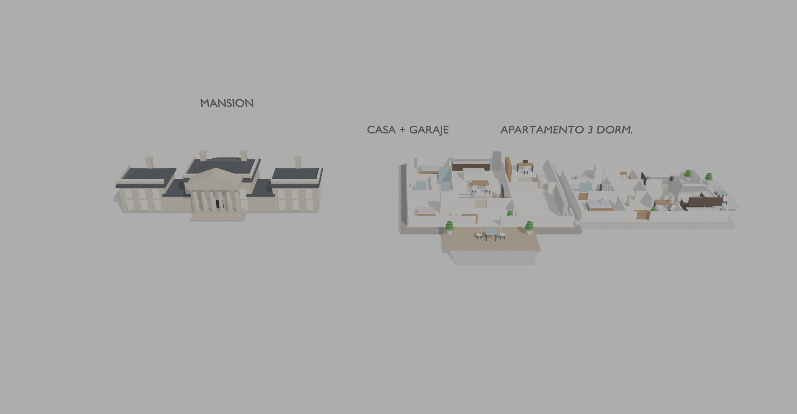

# AUTO_BLENDER — Escena comparativa de viviendas

Escena 3D en Blender que compara tres tipos de vivienda a la misma escala:

| Bloque | Descripción |
|--------|-------------|
| **MANSION** | Mansión neoclásica con pórtico, alas laterales, jardines, piscina, fuente y muro perimetral |
| **CASA + GARAJE** | Casa de una planta amueblada + garaje (planta abierta, sin coche) |
| **APARTAMENTO 3 DORM.** | Apartamento de 3 dormitorios amueblado (planta abierta) |



## Contenido del repositorio

```
assets/scene.blend        Archivo Blender COMPLETO y autocontenido (Blender 5.2.1 LTS, EEVEE)
exports/COMPARATIVA.glb   Export glTF de la escena COMPARATIVA (solo para previsualizar)
renders/comparativa.png   Render de referencia de la escena COMPARATIVA
RESTORE.md                Instrucciones paso a paso para restaurar la escena en otra sesión
CLAUDE.md                 Contexto que Claude Code lee automáticamente al abrir el repo
```

## Restaurar en 1 paso

`assets/scene.blend` contiene TODO (geometría, materiales, cámaras, luces, 4 escenas).
No hay archivos externos ni texturas enlazadas: la única imagen es "Render Result" (generada).

1. Abre `assets/scene.blend` en Blender 5.2.1 o superior — o pídeselo al MCP de Blender.
2. La escena activa es **COMPARATIVA** (cámara `C_Cam`). Cambia entre escenas con el
   selector de escena de la cabecera: `COMPARATIVA`, `MANSION`, `PLAN_A`, `PLAN_B`.

Si trabajas con un agente (Claude Code + MCP de Blender), lee **[RESTORE.md](RESTORE.md)**.
